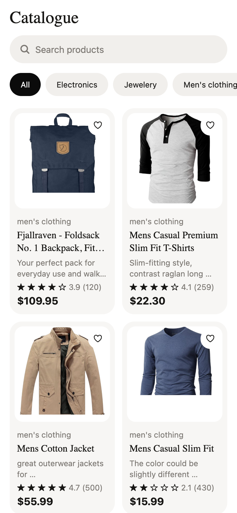
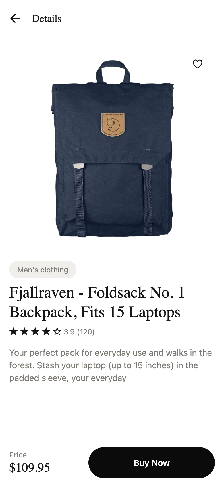
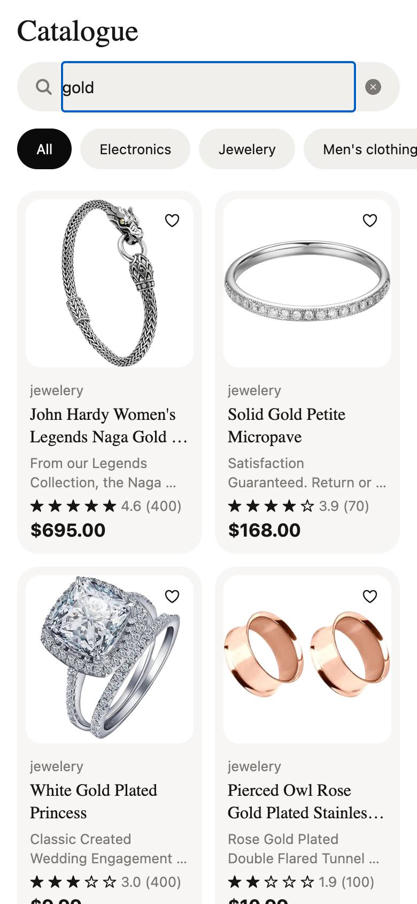
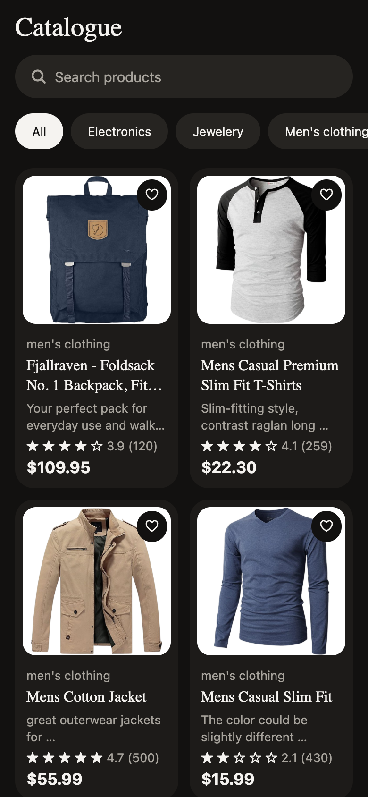
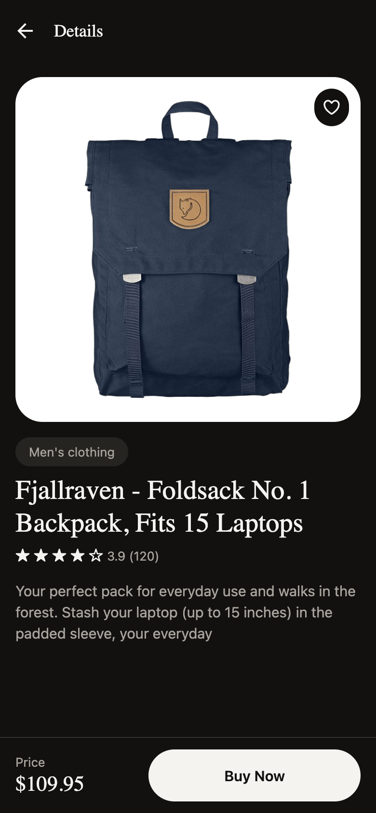

# Product Catalogue — React Native Technical Test

A small, production-minded product catalogue app built with **Expo + TypeScript**. It fetches products from [Fake Store API](https://fakestoreapi.com/products), supports search and category filtering, and handles loading, empty, error and offline states.

## Screenshots

| List (light) | Details (light) | Search | List (dark) | Details (dark) |
| --- | --- | --- | --- | --- |
|  |  |  |  |  |

## Features

- **Product list** — two-column grid with image, title, price, category, description preview and rating
- **Product details** — full description, rating, category pill, price + buy bar
- **Search** — debounced title search with a clear button
- **Category filtering** — horizontal pill tabs fed by the `/products/categories` endpoint
- **Feedback states** — skeleton loaders on first load, empty-search state, error state with retry, pull-to-refresh
- **Offline caching** — the TanStack Query cache is persisted to AsyncStorage, so a previously loaded catalogue renders without a network connection
- **Favourites** — tap the heart on a card or the details screen; persisted across restarts
- **Dark mode** — follows the system appearance
- **Accessibility** — labels, roles and selection state on all interactive elements
- **CI** — GitHub Actions runs typecheck + tests with coverage on every push/PR

## Tech Stack

| Concern | Choice | Why |
| --- | --- | --- |
| Framework | Expo SDK 57 (React Native 0.86, TypeScript strict) | Fastest reliable path to run/review the app on any machine |
| Navigation | React Navigation (native stack) | Typed routes, native transitions/back behaviour |
| Server state | TanStack Query | Caching, retries, refetch and loading/error states without hand-rolled reducers; persisted for offline support |
| Client state | Zustand (persist) | Favourites are the only client state; a store this small doesn't justify Redux |
| Testing | Jest (`jest-expo`) + React Native Testing Library | Behaviour-level tests against accessible queries |

## Installation

```bash
git clone <repo-url>
cd bountip-test
npm install
```

## Running the App

```bash
npm start          # Expo dev server — scan the QR code with Expo Go
npm run ios        # iOS simulator
npm run android    # Android emulator
npm run web        # browser
```

## Running Tests

```bash
npm test                # run all suites
npm run test:coverage   # with coverage report (coverage/lcov-report/index.html)
npm run typecheck       # TypeScript, strict mode
```

**What's covered (14 tests, 4 suites):**

- `filterProducts` — search/category logic, case-insensitivity, whitespace, combined filters, no-match
- `apiGet` — success parsing, HTTP error status mapped to `ApiError`, network failure message
- `ProductCard` — renders all fields, fires `onPress` with the product
- `ProductListScreen` — renders fetched data, filters on typing, empty-search state, error state with retry recovery, navigation to details

## Architecture

```
src/
├── api/          # fetch client (timeout + typed ApiError) and product endpoints
├── components/   # reusable UI: ProductCard, CategoryTabs, SearchBar, RatingStars,
│                 # FavoriteButton, ErrorState, EmptyState, ProductListSkeleton
├── hooks/        # useProducts/useProduct/useCategories (TanStack Query), useDebouncedValue
├── lib/          # pure logic: filterProducts, formatting, query client + persister
├── navigation/   # typed native stack (RootStackParamList)
├── screens/      # ProductListScreen, ProductDetailsScreen
├── store/        # Zustand favourites store (persisted)
├── theme/        # design tokens (light/dark palettes, spacing, radii, type) + ThemeProvider
├── types/        # API response types
└── test-utils/   # provider-wrapped render helper
```

Guiding decisions:

- **Server state vs client state are separated.** TanStack Query owns everything fetched from the API; Zustand owns favourites. Screens never call `fetch` directly.
- **Business logic is pure and out of components.** Search/filter logic lives in `lib/filterProducts.ts`, so it's unit-testable and reusable.
- **Design tokens over ad-hoc styles.** All colours, spacing, radii and type ramp live in `src/theme/tokens.ts`; components read them through `useTheme()`, which is what makes dark mode a palette swap rather than a rewrite.
- **Details screen renders instantly** by seeding from the already-fetched list cache while the detail query refreshes in the background.
- **Web-safe component structure.** The favourite heart overlays the card as a *sibling* of the pressable area — nested pressables render invalid nested `<button>` elements on react-native-web and make touch handling ambiguous on native.

## Assumptions

- The Fake Store API is read-only and unauthenticated; "Buy Now" is presentational.
- The catalogue is small (20 items), so filtering happens client-side and pagination isn't warranted — with a larger API I'd move search/filtering server-side with paginated queries.
- Product `rating` is treated as optional since the requirement says "if available".

## Known Limitations

- Favourites store product IDs only; if a product disappeared from the API the favourite would silently no-op.
- No i18n/currency localisation — prices are formatted as USD to match the API.
- The image area uses a fixed white background so transparent product photos read well in dark mode, mirroring the reference design.
- fakestoreapi.com occasionally responds slowly; the client applies a 12s timeout and surfaces a retry.
